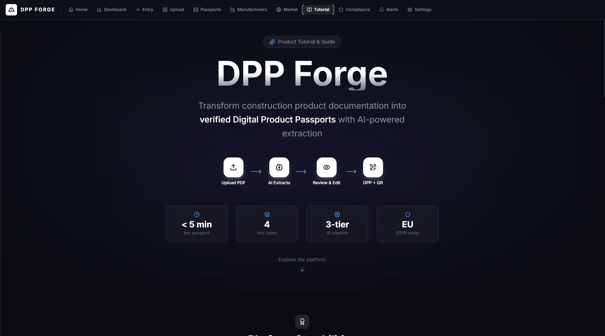
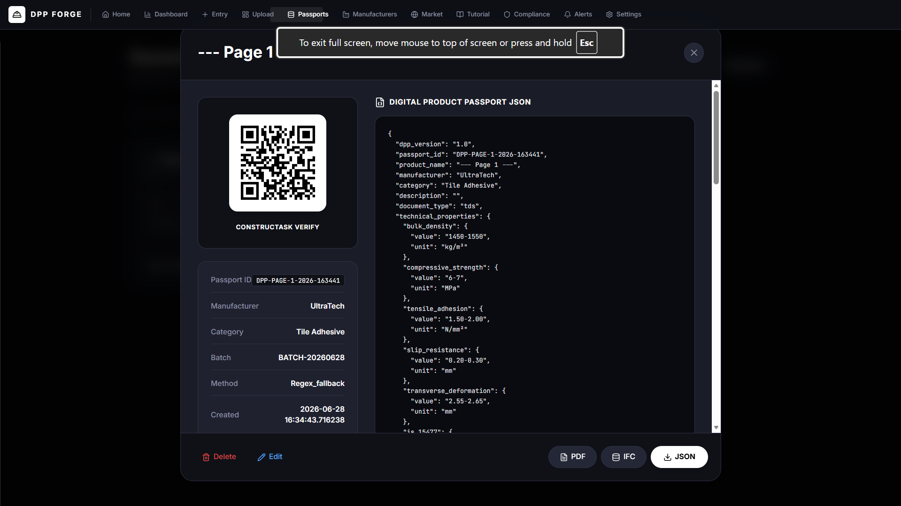
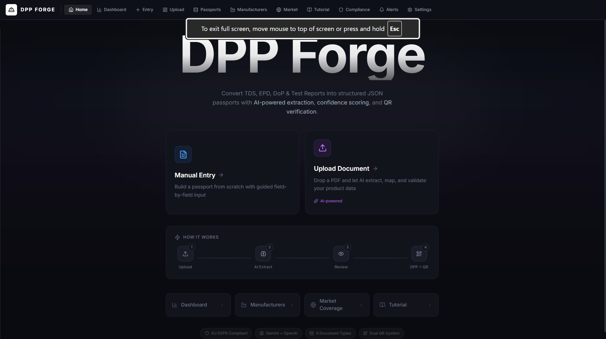

# DPP Forge

Construction-native Digital Product Passport workstation for product passport engineers. It turns manufacturer evidence into reviewed, QR-ready product and batch records while keeping AI extraction, human approval, source rights, and field evidence separate.

## Screenshots





## What It Does

- Uploads and auto-classifies construction product evidence: TDS, EPD, DoP/CE, lab reports, SDS, FPC certificates, warranty, installation, maintenance, end-of-life notes, catalogues, CSV/XLSX, and JSON.
- Detects multi-product evidence and returns separate review drafts instead of silently merging products.
- Builds portable DPP JSON with identity, engineering properties, standards, sustainability, health/safety, supply chain, lifecycle, QR, rights, evidence, and audit sections.
- Preserves original AI confidence and stores human-reviewed confidence separately through a server-side approval gate.
- Requires reviewed confidence of at least 90%, field citations, publication rights, reviewer metadata, resolved identity, and no critical conflicts before publication.
- Records manufacturer outreach, claim profiles, document requests, upload metadata, revision requests, approval, and authority status.
- Links QA/QC records to product passports and generates batch-level QR envelopes.
- Reports independent market coverage for construction and road-construction targets, including missing documents, missing standards, confidence, and expert-validation status.
- Exports JSON, CSV/XLSX, PDF, QR PNG, and IFC data.

## Core Workflows

1. Upload one or more source documents and choose Auto Detect or a specific evidence type.
2. Pick the correct product draft when a source contains multiple products.
3. Review identity, properties, standards, lifecycle fields, citations, rights, and AI confidence.
4. Approve with reviewer name, publication rights, and reviewed confidence.
5. Save the server-approved passport and generate product QR / ConstructAsk QR links.
6. Add manufacturer document requests, upload metadata, claims, revisions, and approvals.
7. Add QA/QC records for batches and use batch QR links for field or label workflows.
8. Use market coverage to see target categories that are missing products, documents, or standards.

## Architecture

- `backend/`: FastAPI, SQLAlchemy models, PDF extraction, AI/regex extraction, DPP approval gates, QR, exports, analytics, CRM, compliance, notifications.
- `src/`: React/Vite workstation UI for upload, review, passports, manufacturers, market coverage, compliance, notifications, dashboard, and settings.
- `backend/models.py`: additive tables for source documents, field evidence, quality records, manufacturer requests/uploads, claims, and market targets.
- `backend/tests/test_converter.py`: integration coverage for extraction, approval, QR, CRM, market coverage, and exports.

## Local Setup

Backend:

```bash
cd backend
pip install -r requirements.txt
python -m uvicorn main:app --reload --port 8001
```

Frontend:

```bash
npm install
npm run dev
```

Useful environment variables:

- `DATABASE_URL`: PostgreSQL or SQLite database URL.
- `PUBLIC_APP_URL`: public frontend URL used in QR verification links.
- `CONSTRUCTASK_URL`: optional ConstructAsk verification URL.
- `TDS_OPENAI_API_KEY`: optional OpenAI extraction key.
- `TDS_GEMINI_API_KEY`: optional Gemini extraction key.
- `TDS_GEMINI_MODEL`: optional Gemini model override.
- `DPP_API_KEY`: optional API key requirement for `/api/*` endpoints.
- `CORS_ORIGINS`: comma-separated allowed frontend origins.

## API Examples

```bash
curl -F "file=@product.pdf" "http://localhost:8001/api/convert/upload?doc_type=auto"
curl -X POST "http://localhost:8001/api/convert/approve" -H "Content-Type: application/json" -d @approval.json
curl "http://localhost:8001/api/analytics/target-market-coverage?sector=road_construction"
curl "http://localhost:8001/api/passports/1/batch/B-100"
```

## Verification

```bash
python -m pytest backend/tests -q
npm run lint
npm run build
```

## Job Description Coverage

- Product data extraction and structuring: upload/manual/spreadsheet workflows plus DPP JSON assembly.
- Data quality and validation: field evidence, immutable AI confidence, human review, rights, conflicts, and audit trail.
- Manufacturer cooperation: CRM pipeline, outreach templates, claims, requests, uploads, revisions, and authority approval.
- Construction market coverage: independent road/construction target catalogue with missing evidence and expert-validation labels.
- QA/QC and field use: product QR, batch QR envelope, quality records, label-ready payloads, PDF/IFC exports.

## Limits

This is a portfolio workstation, not Origentity's production platform. It does not send real emails, place calls, provide legal certification, connect to blockchain/trust registries, or replace ERP/procurement/warehouse systems. Compliance mappings and market targets are operational aids and must be reviewed by qualified civil/materials/compliance experts before authority-grade use.
